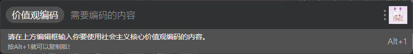
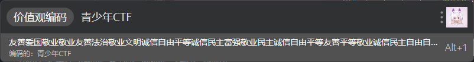
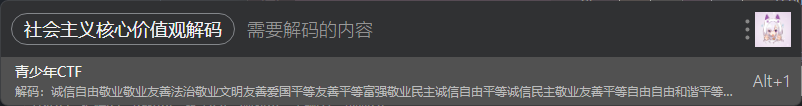
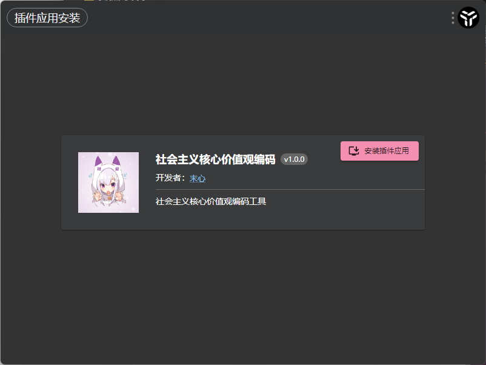

# 关于

这是一个使用Utools API和JavaScript开发的一个“社会主义核心价值观编码”的编解码工具，目前已上架Utools商店。

# 使用说明

## 编码

在Utools搜索界面中，输入关键词`价值观编码`或`社会主义核心价值观编码`（Utools支持快捷搜索，如输入jzgbm、shzy等都可以快速搜索）

在弹出的编辑框中输入需要编码的内容，如“青少年CTF”

接着按下Alt+1键，即可快速复制编码的结果

窗口会自动关闭回到搜索页面

## 解码

在Utools搜索界面中，直接输入“诚信自由敬业敬业友善法治敬业文明友善爱国平等友善平等富强敬业民主诚信自由平等诚信民主敬业友善平等自由自由和谐平等自由自由公正”这种已编码的文本即可快速通配解密。

当然，也可以类似编码的过程，输入`价值观解码`或`社会主义核心价值观解码`也可以类似编码的方法使用。

## 备注

本项目代码为测试时实验编写，本项目完全开源，大家如果有更好的想法可以加qq群797842833交流。

# 发行版

可以前往https://github.com/Moxin1044/utools-cvencode/releases进行查看。

# 安装

## upx文件安装

直接将upx文件拖入Utools搜索窗口，选择安装插件，进行安装。

## Utools官方
目前工具已上线Utools插件商店哦！大家可以尽情使用啦！